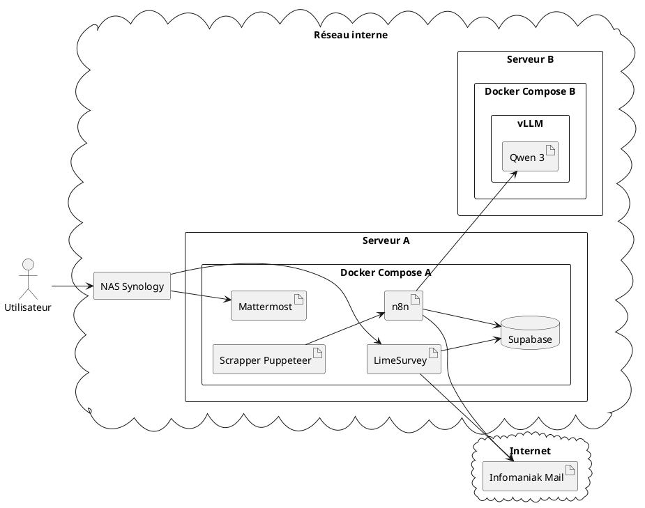
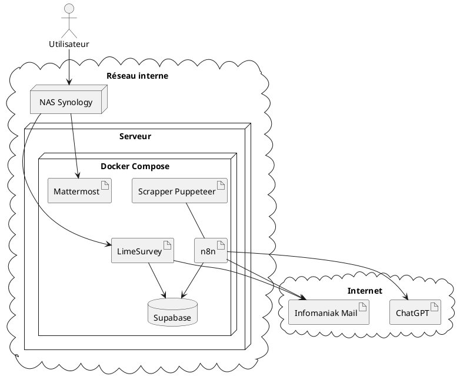
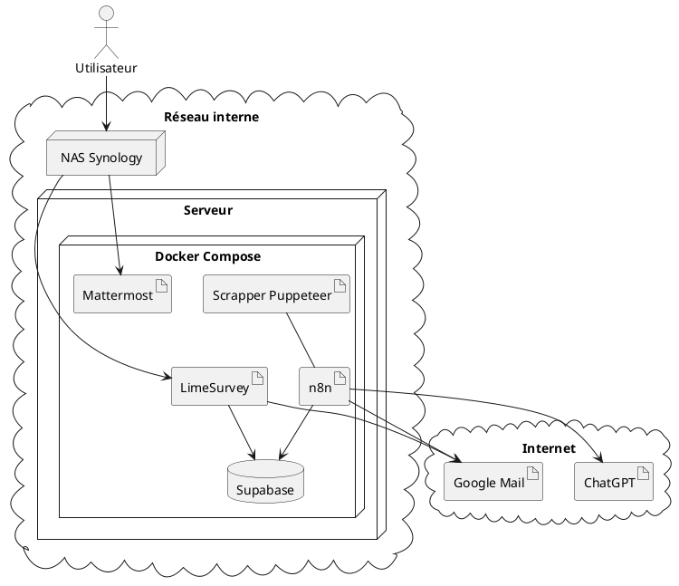
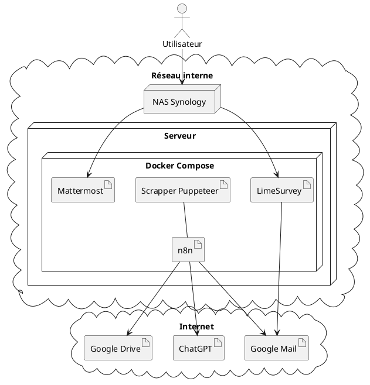

# Architectures de déploiement

Classées anti-chronologiquement.

## Internal LLM migration

```plantuml
@startuml
left to right direction
skinparam packageStyle rectangle
skinparam shadowing false

actor "Utilisateur" as user

cloud "Réseau interne" {

    rectangle "NAS Synology" as nas

    package "Serveur A" {
        package "Docker Compose A" {
            artifact "Mattermost" as mattermost
            artifact "LimeSurvey" as limesurvey
            artifact "Scrapper Puppeteer" as scrapper
            artifact "n8n" as n8n
            database "Supabase" as supabase
        }
    }

    package "Serveur B" {
        package "Docker Compose B" {
            package "vLLM" {
                artifact "Qwen 3" as qwen3
            }
        }
    }
}

cloud "Internet" {
    artifact "Infomaniak Mail" as mailservice
}

' Accès utilisateur
user --> nas
nas --> mattermost
nas --> limesurvey

' Flux applicatifs internes
scrapper --> n8n
n8n --> supabase
limesurvey --> supabase

' Appel LLM interne
n8n --> qwen3

' Services externes
n8n --> mailservice
limesurvey --> mailservice

@enduml
```

## Infomaniak Mail migration

```plantuml
@startuml
actor "Utilisateur" as user

cloud "Internet" {
    artifact "ChatGPT" as chatgpt
    artifact "Infomaniak Mail" as mailservice
}

cloud "Réseau interne" {
    node "NAS Synology" as nas {
    }

    node "Serveur" {
        node "Docker Compose" {
            artifact "n8n" as n8n
            artifact "LimeSurvey" as limesurvey
            artifact "Scrapper Puppeteer" as scrapper
            artifact "Mattermost" as mattermost
            database "Supabase" as supabase
        }
    }
}

' Relations internes
scrapper -- n8n
n8n --> supabase
limesurvey --> supabase

' Appels vers services externes
n8n --> chatgpt
n8n --> mailservice
limesurvey --> mailservice

' Accès utilisateurs
user --> nas
nas --> mattermost
nas --> limesurvey

@enduml
```

## Superbase migration

```plantuml
@startuml
actor "Utilisateur" as user

cloud "Internet" {
    artifact "ChatGPT" as chatgpt
    artifact "Google Mail" as mailservice
}

cloud "Réseau interne" {
    node "NAS Synology" as nas {
    }

    node "Serveur" {
        node "Docker Compose" {
            artifact "n8n" as n8n
            artifact "LimeSurvey" as limesurvey
            artifact "Scrapper Puppeteer" as scrapper
            artifact "Mattermost" as mattermost
            database "Supabase" as supabase
        }
    }
}

' Relations internes
scrapper -- n8n
n8n --> supabase
limesurvey --> supabase

' Appels vers services externes
n8n --> chatgpt
n8n --> mailservice
limesurvey --> mailservice

' Accès utilisateurs
user --> nas
nas --> mattermost
nas --> limesurvey

@enduml
```

## Initial version

```plantuml
@startuml
actor "Utilisateur" as user

cloud "Internet" {
    artifact "ChatGPT" as chatgpt
    artifact "Google Drive" as gdrive
    artifact "Google Mail" as mailservice
}

cloud "Réseau interne" {
    node "NAS Synology" as nas {
    }

    node "Serveur" {
        node "Docker Compose" {
            artifact "n8n" as n8n
            artifact "LimeSurvey" as limesurvey
            artifact "Scrapper Puppeteer" as scrapper
            artifact "Mattermost" as mattermost
        }
    }
}

' Relations internes
scrapper -- n8n

' Appels vers services externes
n8n --> chatgpt
n8n --> gdrive
n8n --> mailservice

' Accès utilisateurs
user --> nas
nas --> mattermost
nas --> limesurvey
limesurvey --> mailservice

@enduml
```