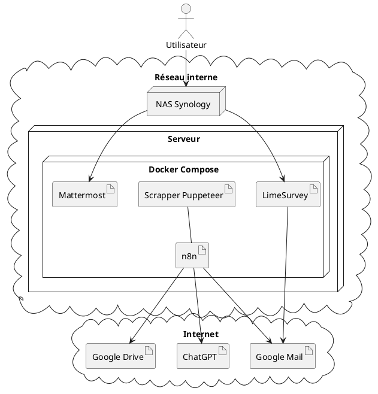

# Veille Emploi Interne

## Contexte

### Emploi Lausanne

Emploi Lausanne (EL) accueille des personnes en recherche d'emploi (appelés "participants") et a
pour mission :

- d'améliorer leur profil par l'emploi sur des projets internes.
- de les accompagner dans leur recherche d'emploi.

Il est important de comprendre qu'EL est une administration publique : l'accueil des participants est subventionné, la valeur livrée se mesure également en termes de développement individuel et de réinsertion par l'activité.

### Environnement technologique

Le diagramme ci-dessous représente l'environnement technologique initial.

## Objectifs du projet

### Le processus à automatiser

Dans le cadre de sa mission, EL rassemble des offres d'emploi et les distribue aux participants. La sélection manuelle des offres, leur saisie et leur distribution sont chronophages car c'est une procédure manuelle.

Le processus se décompose ainsi :

A1. **Initialisation** : **s'inscrire aux listes** de diffusion **d'offres** (Indeed, ...)

A2. **Consolidation et envoi** des offres

En suivant cette procédure :

* **parcourir les offres** reçues et **sélectionner** celles dont le **titre** peut correspondre aux **métiers pris en charge** par EL

* pour chacune d'elle, **analyser le contenu** pour les sélectionner par rapport aux métiers

* **extraire et renseigner dans** le fichier **excel** :
  * entreprise
  * lieu
  * poste
  * date de mise en ligne
  * missions
  * profil
  * délai
  * lien d'accès

* **exporter** le fichier en **PDF**

* **créer un email** et l'y **joindre**.

* l'**envoyer** à **veilleemploi5d@emploilausanne.ch**

A3. **Inscription / désinscription** de **nouveaux participants** à la liste de diffusion.

## Fonctionnalités

- recevoir une courte synthèse des offres
- recevoir toutes les offres résumées par email
- consulter les offres pertinentes

- recevoir les offres concernant mon métier par email
- ajouter des informations aux offres
- améliorer la mise en page
- expédier d'une source plus crédible
- éviter les coûts du LLM
- améliorer le filtrage des offres
- informations supplémentaires
- finaliser l'automatisation