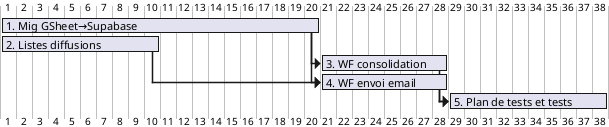

# Sprint 1

## Objectif

- disposer d'un pilote de l'email, envoyé aux participants pour feedbacks.

## Tâches (⚡SP: 25)

- **Créer un plan de test et tester l'envoi d'emails ciblés par groupes métiers**  ⚡SP: 3

- **Modifier le workflow d'envoi d'email pour préparer un email par groupe métier** ⚡SP: 3

- **Modifier le workflow "consolidation" pour associer chaque offre à des groupe métiers en base** ⚡SP: 5

- **Migration de google sheet vers supabase et support des groupes métiers** ⚡SP: 5

- **Créer les listes de diffusions pour abonnement aux groupes métiers** ⚡SP: 3

- **Informations supplémentaires sur les offres** ⚡SP: 2

- **Mise en forme de l'email**  ⚡SP: 1

- **"veilleemploi" comme expéditeur dans workflow d'envoi**  ⚡SP: 3

### Séquence

