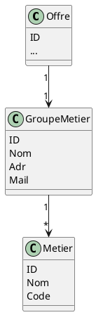
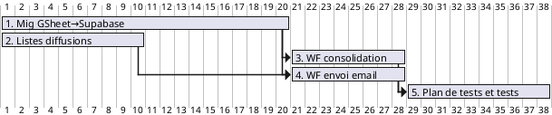

# Cibler les offres par groupes métiers

## Intro

Cibler les offres par groupes métier est un jalon pour cibler par la suite les offres par participant, qui ajoute de la valeur utilisateur au workflow non ciblé actuel.

## Etapes :

1. [**Migration de google sheet vers supabase et support des groupes métiers**](https://gitlab.com/5DMCW/ai-automatisation-offres/-/issues/29)

:dart: Résultat Attendu :

Les workflows existants (consolidation et envoi d'email) utilisent une base de données superbase à la place de google sheet et la base est prête pour gérer les groupes métier et lier les offres à ces groupes.

Choix technique collégial : superbase comme base de donnée, en particulier pour des raisons de montée en compétences et pour l'accès direct depuis n8n.

**Brouillon** de modèle conceptuel réalisé en réunion :

2. [**Créer les listes de diffusions pour abonnement aux groupes métiers**](https://gitlab.com/5DMCW/ai-automatisation-offres/-/issues/28)

Note : Elles seront éditées manuellement. Leur gestion est une tâche intéressante pour d'autres participants.

:dart: Résultat Attendu :

Disposer de listes de diffusion initiales pour les [groupes métiers](https://gitlab.com/5DMCW/ai-automatisation-offres/-/wikis/home/Veille-Emploi-Automatis%C3%A9e/Analyses/M%C3%A9tiers) contenant un petit échantillon de participants ainsi que les membres de l'équipe automatisation. Mettre "nicolas.enzweiler@emploilausanne.ch" dans toutes les listes.

3. [**Modifier le workflow "consolidation" pour associer chaque offre à un groupe métiers en base**](https://gitlab.com/5DMCW/ai-automatisation-offres/-/issues/30)

:dart: Résultat Attendu :

Le workflow utilise les groupes métiers définis en base (entrée) pour associer chaque nouvelle offre à des groupes métiers en base (sortie).

4. [**Modifier le workflow d'envoi d'email pour préparer un email par groupe métier**](https://gitlab.com/5DMCW/ai-automatisation-offres/-/issues/31)

:dart: Résultat Attendu :

Le workflow fait une boucle les groupes métiers définis en base et prépare un email différent pour chaque groupe.

5. [**Créer un plan de test et tester l'envoi d'emails ciblés par groupes métiers**](https://gitlab.com/5DMCW/ai-automatisation-offres/-/issues/34)

:dart: Résultat Attendu :

Une page du wiki contient un plan de tests manuels minimaliste à effectuer pour détecter les régressions avant chaque mise en production.

Ces tests ont été exécutés manuellement sur la version à livrer.

## Enchaînement

## Références

(1) [Groupe et liste des métiers](https://gitlab.com/5DMCW/ai-automatisation-offres/-/wikis/home/Veille-Emploi-Automatis%C3%A9e/Analyses/M%C3%A9tiers)

---

## Migration de google sheet vers supabase et support des groupes métiers

:dart: Résultat Attendu :

Les workflows existants (consolidation et envoi d'email) utilisent une base de données superbase à la place de google sheet et la base est prête pour gérer les groupes métier et lier les offres à ces groupes.

### **:white_check_mark: Critères d'Acceptation :**

* [ ] Critère 1 : la base de donnée est conçue, créée et les groupes métiers sont renseignés

* [ ] Critère 2 : les workflow permettent toujours d'envoyer l'email unique et ne sont pas perturbées par le changement de base

---

## Créer les listes de diffusions pour abonnement aux groupes métiers

### :dart: Résultat Attendu :

Disposer de listes de diffusion initiales pour les [groupes métiers](https://gitlab.com/5DMCW/ai-automatisation-offres/-/wikis/home/Veille-Emploi-Automatis%C3%A9e/Analyses/M%C3%A9tiers) contenant un petit échantillon de participants ainsi que les membres de l'équipe automatisation. Mettre "nicolas.enzweiler@emploilausanne.ch" dans toutes les listes.

### **:white_check_mark: Critères d'Acceptation :**

* [x] Critère 1: Les listes de diffusion existent et sont prêtes à l'emploi pour envoi d'emails

---

## Modifier le workflow "consolidation" pour associer chaque offre à des groupe métiers en base

### :dart: Résultat Attendu :

Le workflow utilise les groupes métiers définis en base (entrée) pour associer chaque nouvelle offre à des groupes métiers en base (sortie).

### **:white_check_mark: Critères d'Acceptation :**

* [ ] Critère 1 : dans la base les offres sont associées à des groupes métiers et ces groupes correspondent réellement à l'offre
* [ ] Critère 2 : le workflow d'envoi fonctionne toujours correctement et ne prend pas en compte les groupes métiers

Etapes pré-senties :

* récupérer la liste des GM
* modifier le prompt pour associer les tags avec les offres
* modifier l'insertion des offres en bases de données

---

## Modifier le workflow d'envoi d'email pour préparer un email par groupe métier

### :dart: Résultat Attendu :

Le workflow fait une boucle les groupes métiers définis en base et prépare un email différent pour chaque groupe.

### **:white_check_mark: Critères d'Acceptation :**

* [ ] Critère 1 : le workflow prépare un email spécifique pour chaque GM et le contenu est pertinent

---

## Créer un plan de test et tester l'envoi d'emails ciblés par groupes métiers

## :dart: Résultat Attendu :

Une page du wiki contient un plan de tests manuels minimaliste à effectuer pour détecter les régressions avant chaque mise en production.

Ces tests ont été exécutés manuellement sur la version à livrer.