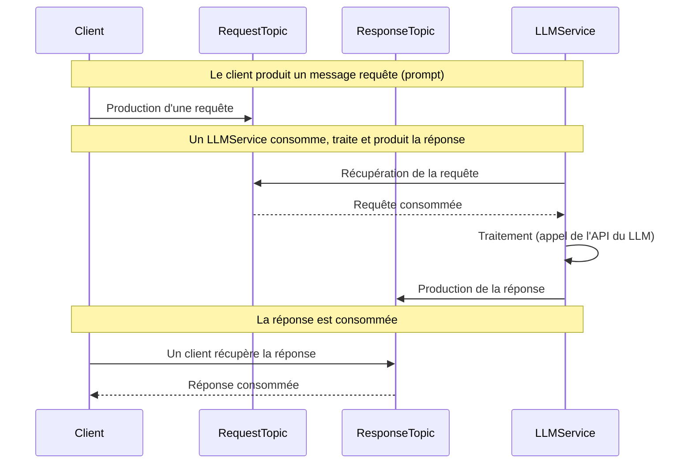

# grpc

## Modes

* Unary
* LLMService streaming
* Client streaming
* Bidirectional streaming

## JS tools

* grpc
* @grpc/proto-loader: generator

[https://youtu.be/Yw4rkaTc0f8?list=PL12XW6i6zqKsK3nax9AYFYuTlEgzH7zCh\&t=2001](https://youtu.be/Yw4rkaTc0f8?list=PL12XW6i6zqKsK3nax9AYFYuTlEgzH7zCh\&t=2001)

[https://grpc.io/docs/what-is-grpc/core-concepts/](https://grpc.io/docs/what-is-grpc/core-concepts/)
